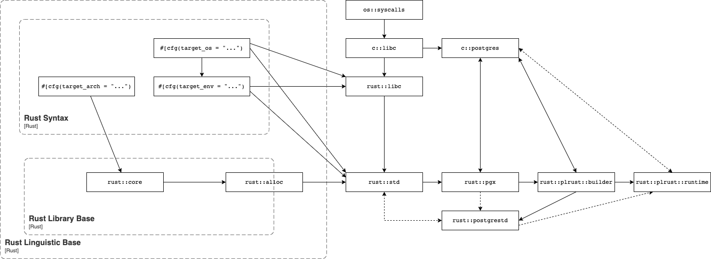

# Architecture

PL/Rust, a Rust-based extension built using [pgx](https://github.com/tcdi/pgx), provides a procedural language handler for Rust in PostgreSQL. When installed, PL/Rust allows this to work:

```sql
CREATE FUNCTION {fn_name} ({args})
RETURNS {ret}
-- function attributes can go here
AS $$
    // PL/Rust function body goes here
$$ LANGUAGE plrust;
```

PL/Rust will compile the function as a dynamic library, load it, and execute it.

## Trusted Language

In order to create a [trusted](https://www.postgresql.org/docs/current/sql-createlanguage.html) language handler in PostgreSQL we must restrict the functions compiled and executed by the language handler to the set of operations other code in PostgreSQL has access to.

- No operations on files except through the database itself
- Limit access to the database to that of other procedural language functions
- Limit access to system resources to those of a trusted language user function
- It must be sound enough to allow any unprivileged database user to use the language ([postgresql.org](https://www.postgresql.org/docs/current/plperl-trusted.html))

## Rust

While interpreted languages like Perl or Python execute in a runtime component, the Rust language must be compiled to a specific target.  A target can be a shared object, binary, or wasm artifact.  The operating system or host process executes the shard object (or binary) in a similar manner to C.  Rust provides support for unsafe memory operations through the use of the unsafe keyword.  Code tagged in this manner indicates to the compiler that the code does not need to be checked for memory safety and the developer has ensured it safety.

A target tuple describes a "platform" that can execute code. Rust uses rustc, which requires that code is ahead-of-time compiled in order to do code generation, so it requires a target tuple that defines the code object it must generate. A code object has a format (e.g. ELF or Windows PE) which an operating system supports, instructions (e.g. aarch64 or wasm) which a machine architecture supports, and calls to system interfaces to the operating system (such as via GNU `libc.so` or MacOS `libSystem.dylib`) which require holistic support. These code objects may be executables (which the system may initialize as a process) or libraries (which may be "linked", relocating code from them into the final executable at build time, or loading their code to call at runtime). Libraries used at build time are also called static libraries, objects, or archives. Libraries used at runtime are also called dynamic libraries or shared objects.

The Rust compiler builds the Rust standard library as a static library and then links it into Rust code objects. The contents of this static library include the code which dynamically links against system interfaces. These system interfaces are what postgrestd intercepts by itself being a modification of the Rust standard library.

The extension called "PL/Rust" which includes the language handler is responsible for covering the linking and loading steps. This extension may have privileges that user functions do not, using the Rust std of the same host target that PostgreSQL itself is compiled for, to interoperate in that privileged mode. This is as-usual for language handlers: they must typically be written in C.

## Design Goals

Design a custom rust compilation target for PostgreSQL that provides nearly "safe" (as Rust defines it) and "trusted" (as PostgreSQL defines a procedural language) PL/Rust.

The goals for the approach include

* Architecture support for x86_64 and aarch64
* Operating system support for Linux
* Disallow File Handle operations
* Disallow access to the internals of the database
* Disallow access to the OS as the user executing the PostgreSQL process 
* Disallow access into active postmaster process, i.e. no ability to reach into PostgreSQL memory space, despite executing inside it.
* Gracefully handle rust panics and have them interoperate with PostgreSQL' transaction system
* Memory allocation within PostgreSQL' palloc/pfree functions

## Approach

The PL/Rust extension is compiled using the standard rust library.  The postgrestd library is used to compile the functions written using PL/Rust.  The postgrestd library is a libraries are compiled using The 

Following an approach similar to the selection between libc and the musl libc standard library for compilation, a PostgreSQL compilation target is defined that instructs the compiler to use the postgrestd library.  The postgrestd library provides the rust standard library interfaces except in the case where it is desirable to prevent access.  In those cases the code is [configured](https://doc.rust-lang.org/stable/rust-by-example/attribute/cfg.html) to be not present. The result is a small shim on top of the rust library limited access to the standard library.


## Bird's Eye View




## Supporting Crates

Because PL/Rust implements a fairly complicated language and makes it sound to use as a trusted procedural language, there are multiple supporting crates necessary to make it work.

### pgx with `features = ["postgrestd", ..]`

The PL/Rust language handler is itself implemented using pgx, but also all PL/Rust functions must understand the PostgreSQL data types in the same way that `pgx` enables. In addition, bindings via `pgx` are used to implement most of the other supporting crates.

### pallocator

The PostgreSQL allocator project maps the PostgreSQL memory allocation methods to standard library methods.  the memory allocation from standard library methods to PostgreSQL specific methods.

| libc    | postgrestd |
|---------|------------|
| alloc   | palloc     |
| free    | pfree      |
| realloc | prealloc   |

### postpanic

The PostgreSQL panic project maps the rust panic to the PostgreSQL panic, allowing PostgreSQL to handle the panic within the transaction system.

### postgrestd

See [postgrestd](https://github.com/tcdi/postgrestd) for more details.

## Cross-Cutting Concerns

This sections talks about the things which are everywhere and nowhere in particular.

### Code generation

### Cancellation

### Testing

### Error Handling

### Observability
