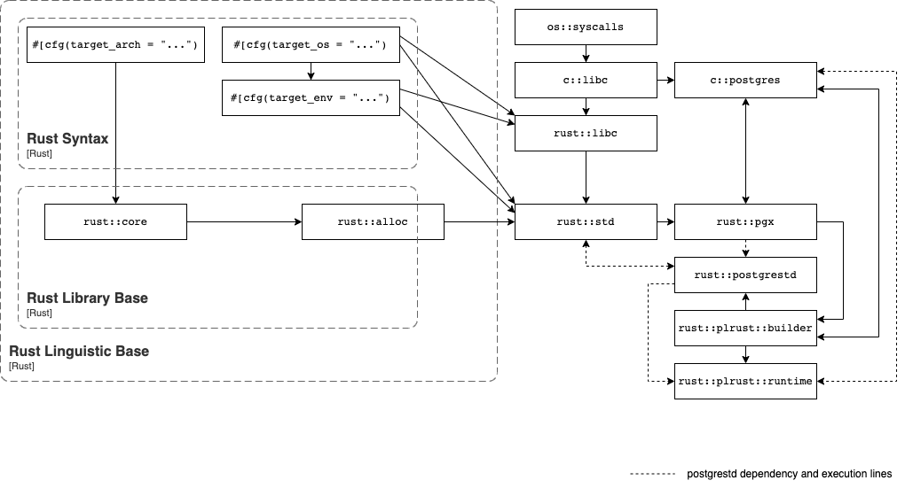

# Architecture

This document describes the high-level architecture of plrust.
If you want to familiarize yourself with the code base, you are just in the right place!

## Bird's Eye View

## Code Map

This section talks briefly about various important directories and data structures.

###

## Cross-Cutting Concerns

This sections talks about the things which are everywhere and nowhere in particular.

### Code generation

### Cancellation

### Testing

### Error Handling

### Observability
