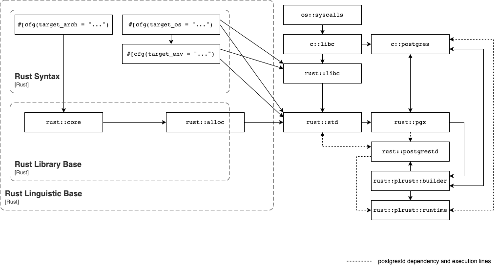

# Architecture

PL/Rust, a Rust-based extension built using [pgrx](https://github.com/tcdi/pgrx), provides a procedural language handler for Rust in PostgreSQL. When installed, PL/Rust allows this to work:

```sql
CREATE FUNCTION {fn_name} ({args})
RETURNS {ret}
-- function attributes can go here
AS $$
    // PL/Rust function body goes here
    // All PL/Rust functions return Result<Option<{ret}>>
$$ LANGUAGE plrust;
```

PL/Rust will compile the function as a dynamic library, load it, and execute it.

## Trusted Language

In order to create a [trusted](https://www.postgresql.org/docs/current/sql-createlanguage.html) language handler in PostgreSQL we must restrict the functions compiled and executed by the language handler to the set of operations other code in PostgreSQL has access to.

- No operations on files except through the database itself
- Limit access to the database to that of other procedural language functions
- Limit access to system resources to those of a trusted language user function
- It must be sound enough to allow any unprivileged database user to use the language ([postgresql.org](https://www.postgresql.org/docs/current/plperl-trusted.html))

## Rust

A target tuple describes a "platform" that can execute code. Rust uses rustc, which requires that code is ahead-of-time compiled in order to do code generation, so it requires a target tuple that defines the code object it must generate. A code object has a format (e.g. ELF or Windows PE) which an operating system supports, instructions (e.g. aarch64 or wasm) which a machine architecture supports, and calls to system interfaces to the operating system (such as via GNU `libc.so` or MacOS `libSystem.dylib`) which require holistic support. These code objects may be executables (which the system may initialize as a process) or libraries (which may be "linked", relocating code from them into the final executable at build time, or loading their code to call at runtime). Libraries used at build time are also called static libraries, objects, or archives. Libraries used at runtime are also called dynamic libraries or shared objects.

The Rust compiler builds the Rust standard library as a static library and then links it into Rust code objects. The contents of this static library include the code which dynamically links against system interfaces. These system interfaces are what postgrestd intercepts by itself being a modification of the Rust standard library.

The extension called "PL/Rust" which includes the language handler is responsible for covering the linking and loading steps. This extension may have privileges that user functions do not, using the Rust std of the same host target that PostgreSQL itself is compiled for, to interoperate in that privileged mode. This is as-usual for language handlers: they must typically be written in C.

## Design Goals

Design a custom rust compilation target for PostgreSQL that provides nearly "safe" (as Rust defines it) and "trusted" (as PostgreSQL defines a procedural language) PL/Rust.

The goals for the approach include

* Architecture support for x86_64 and aarch64
* Operating system support for Linux
* Disallow File Handle operations
* Disallow access to the internals of the database
* Disallow access to the OS as the user executing the PostgreSQL process 
* Disallow access into active postmaster process, i.e. no ability to reach into PostgreSQL memory space, despite executing inside it.
* Gracefully handle rust panics and have them interoperate with PostgreSQL's transaction system
* Memory allocation within PostgreSQL's palloc/pfree functions

## Approach

Following an approach similar to the selection between libc and the musl libc standard library for compilation, a PostgreSQL compilation target is defined that instructs the compiler to use the postgrestd library.  The postgrestd library provides the rust standard library interfaces except in the case where it is desirable to prevent access.  In those cases the code is [configured](https://doc.rust-lang.org/stable/rust-by-example/attribute/cfg.html) to be not present. The result is a small shim on top of the rust library limited access to the standard library.

## Bird's Eye View




## Supporting Crates

Because PL/Rust implements a fairly complicated language with the intention to make it sound to use as a trusted procedural language, there are multiple supporting crates necessary to make it work.

### postgrestd

See [postgrestd](https://github.com/tcdi/postgrestd) for more details.

## Cross-Cutting Concerns

This sections talks about the things which are everywhere and nowhere in particular.

### Code generation

PL/Rust uses [Cargo] for code generation. Each function is built as its own crate to allow it to be individually dynamically loaded (however this is not a strict requirement: multiple functions could be generated together, it's merely a current implementation detail that simplifies some handling).

PL/Rust builds reuse the same build directory to assist in exploiting the existing [build caching][build-cache] implemented in Cargo. However, because of the [resolver], as soon as dependencies are involved, and because building PL/Rust code involves a nonzero number of default crate dependencies, the exact build graph may vary from build to build even for what appears to be the "same crate" to a programmer, as subtle changes in feature or version resolution can all cause the crate to need to be recompiled.

### Cancellation

### Testing

### Error Handling

### Observability

[Cargo]: https://doc.rust-lang.org/cargo/guide
[build-cache]: https://doc.rust-lang.org/cargo/guide/build-cache.html
[resolver]: https://doc.rust-lang.org/cargo/reference/resolver.html
